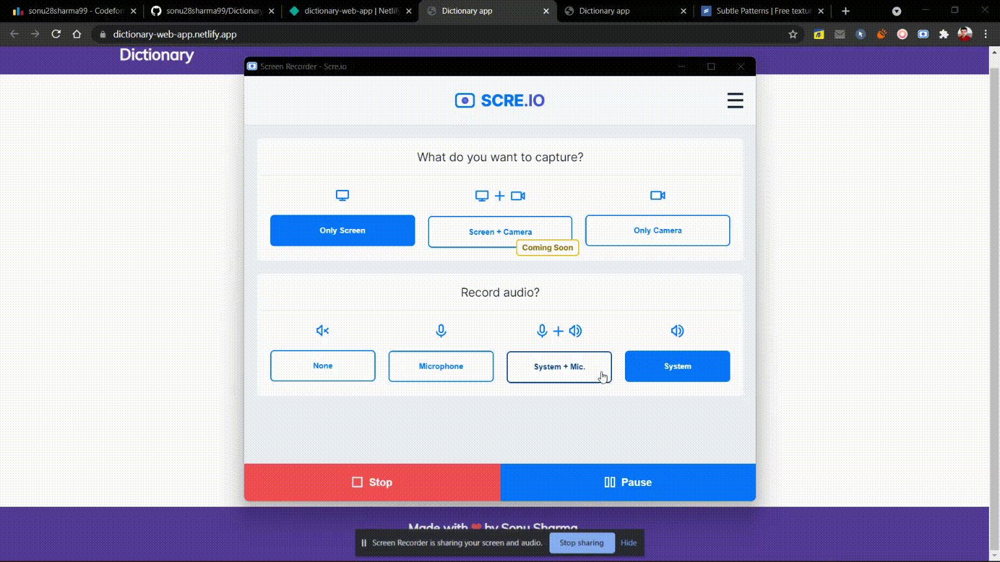

# DICTIONARY APP📗

## Some feature highlight of our Web Applicaton
- It's a web application that gives the meaning of any word that exist in this world.
- it also has a pronounce word features by which you can listen the correct pronunciation of the difficult words.
- If user enter a wrong word then it by default suggest some words matching to that word.

## Demo of this project

### You can see this project live at **[here](https://dictionary-web-app.netlify.app/)** or  **https://dictionary-web-app.netlify.app**

## Installation

You have to install VSCode for running this project any other editor is also fine.

if you don't have VS Code then you can download it from here:- 

[Download VS Code Studio](https://code.visualstudio.com/download)

## Contributing
Pull requests are welcome. For major changes, please open an issue first to discuss what you would like to change.

Please make sure to update tests as appropriate.

## License
[MIT](https://choosealicense.com/licenses/mit/)